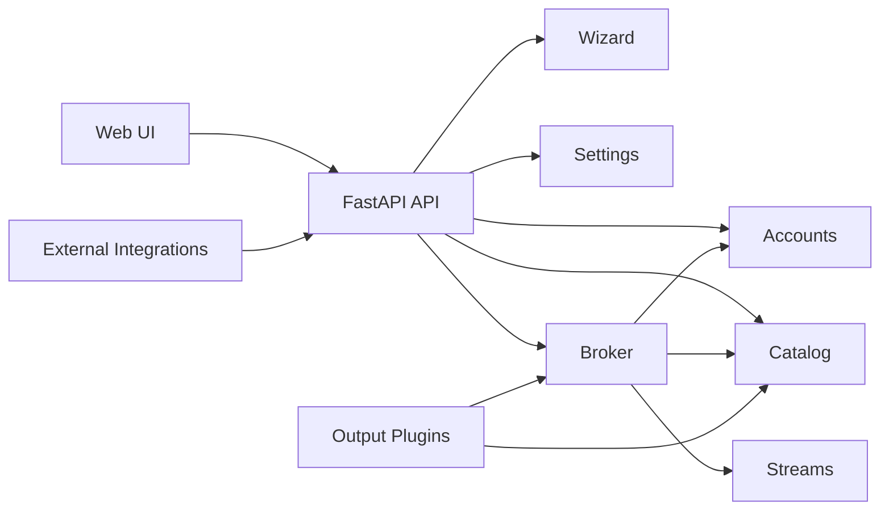
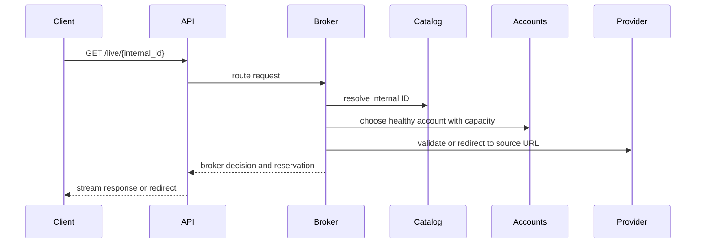
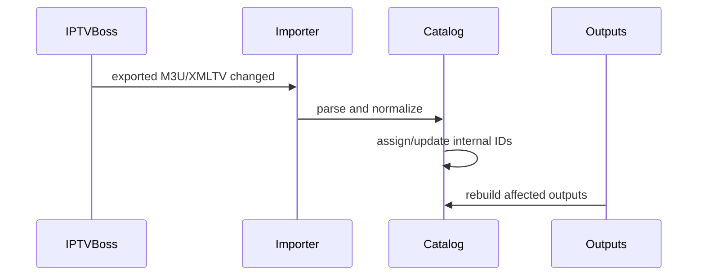

# Architecture

## Intent

Media Router should grow as a modular platform, not as a collection of scripts. Each major capability should have a clear owner, explicit contracts, and a narrow integration surface.

## Architectural Principles

- IPTV Boss is the editorial source; Media Router reads exports but never edits IPTV Boss data.
- Media Router owns the runtime catalog derived from editorial/import sources.
- Outputs are disposable build artifacts generated from catalog and settings.
- Plugins communicate only through the service layer and never access SQLite directly.
- Every movie, episode, and live channel has exactly one internal ID.
- The web UI is the normal configuration surface.
- Manual file editing is reserved for recovery or advanced debugging.
- The catalog is the source of internal media identity.
- Broker URLs are stable even when provider URLs change.
- The broker never exposes provider credentials.
- Outputs consume catalog and broker contracts, not provider account internals.
- Integrations are adapters, not core business logic.
- Host paths and Docker container paths are stored separately.
- Secrets handling must be deliberate before production use.

## Runtime Shape



## Modules

| Module | Responsibility |
| --- | --- |
| Wizard | First-run setup, environment discovery, and setup completion flow. |
| Discovery | Read-only inspection of Docker, mounts, media folders, and likely service locations. |
| Settings | UI-managed configuration, path mapping, and secrets boundary. |
| Accounts | IPTV account metadata, limits, priorities, headers, timeouts, health state, and credentials. |
| Catalog | Permanent internal IDs and source mappings for movies, episodes, and live channels. |
| Broker | Stream routing, account selection, balancing, failover, and reservation creation. |
| Streams | Active stream reservations, expiry, and usage reporting. |
| Outputs | Plugin boundary for STRM, M3U, XMLTV, HDHomeRun, REST, and future outputs. |
| Integrations | Adapters for Emby, Jellyfin, NextPVR, Channels DVR, IPTV Boss, and future services. |

## Backend Layout

```text
app/
  api/          HTTP routers and request/response boundaries
  core/         app config, logging, security primitives
  db/           persistence setup and migrations
  domain/       shared domain contracts and stable types
  modules/      feature modules and local README ownership docs
  plugins/      plugin contracts and plugin implementations
  schemas/      shared API schemas only when truly cross-module
  services/     cross-module orchestration entrypoints
  static/       browser assets for the web UI
  templates/    server-rendered app shell
```

## Playback Flow



## Import Flow



IPTV Boss remains read-only from Media Router's point of view. Importers derive runtime catalog records from exported files, but editorial corrections should be made upstream in IPTV Boss.

## Plugin Boundary

Plugins must communicate through service-layer contracts. They must not directly open SQLite, import database sessions, or depend on module-owned persistence details.

Approved plugin-facing capabilities should include:

- Catalog reader.
- Broker URL builder.
- Settings reader.
- Path mapper.
- Event logger.
- Job status reporter.

## Identity Boundary

Catalog identity belongs to Media Router. Each movie, episode, and live channel has exactly one internal ID. Multiple provider URLs and account-specific sources may map to that one ID.

## Foundation Status

The current codebase intentionally includes only a runnable FastAPI scaffold, domain contracts, module folders, and foundation endpoints. Feature APIs should be introduced one module at a time.
