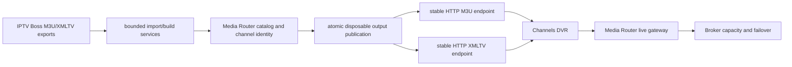

# Roadmap

Media Router planning uses product milestones rather than implementation sprints. This
roadmap was reconciled against release `v0.10.0` (`88da1bc`) and the implementation
and tests at that commit. A documented intention is not counted as delivered.

## v0.10.0 capability baseline

| Capability | Status | Implementation-grounded assessment |
| --- | --- | --- |
| Provider/account management | Complete | Persistent CRUD, priorities, weights, stream limits, enablement, headers, and source association are implemented. |
| Catalog/import pipeline | Partial | M3U file/URL import, parsing, pagination, and four media types work. Automated watching, richer reconciliation, and configurable normalization do not. |
| Stable catalog identity | Partial | Internal IDs and separate editorial channel placements are established. Cross-feed VOD identity remains heuristic; the optional source-entry ledger is shadow-only. |
| Source availability | Complete | Provider/account-specific availability is separate from canonical catalog identity and drives Broker selection. |
| Reservation Broker and account capacity | Complete | Atomic capacity-consuming provisional/active leases, selection explanations, expiry, renewal, release, supersession, and visible versus authoritative counts are implemented and tested. |
| Failover | Partial | The live gateway performs bounded source failover before returning bytes. VOD remains redirect-based and cannot observe or recover from a provider failure after handoff. |
| Live streaming gateway | Complete | Live bytes remain server-side, with commit-before-connect, Range support, heartbeat, disconnect/EOF release, credential containment, and last-owner semantics. |
| Live M3U output | Complete | Bounded generation, preview, dry-run, tracking/history, placement preservation, and runtime URLs work. Delivery is still filesystem/static-server based. |
| XMLTV handling | Not implemented | No XMLTV ingestion, storage, transformation, generation, or native serving contract exists. |
| STRM/VOD output | Complete | Movie/episode generation, scoped and global builds, bounded concurrency, path safety, cleanup, cancellation, and runtime-only contents are tested. |
| Output tracking/history | Complete | Generated-file tracking and bounded run history exist for STRM and Live M3U. |
| Emby integration | Partial | Application-side polling, health, normalized observations, bindings, lifecycle evidence, and live/VOD validation exist. It is not library synchronization or an Emby-installed plugin. |
| Channel mappings | Complete | Preview/refresh, durable markers, exact mappings, guarded placement-title fallback, manual override, pagination, and lifecycle use are implemented. |
| VOD mappings | Partial | Exact server-scoped movie/episode mapping CRUD and lifecycle use work. Bulk application and durable automated crosswalk creation are intentionally absent. |
| Playback correlation | Partial | Runtime paths, durable IDs, exact mappings, recent observations, and existing bindings are supported conservatively. Unmapped/ambiguous VOD remains unmatched by design. |
| Reservation adoption | Complete | Unique recent provisional adoption and recent gateway-owned live adoption are atomic and capacity-neutral; ambiguity fails open without guessing. |
| Backup/restore | Complete | Protected, consistency-safe backup, validation, empty-target restore, dry-run, and acceptance tests are present. Generated outputs remain disposable and excluded. |
| Database migrations | Complete | Versioned startup migrations, per-version transactions, integrity/foreign-key checks, retry after failure, and newer-schema refusal are tested. |
| Diagnostics/logging | Partial | Logs, job state, Broker explanations, integration status, and bounded diagnostics exist. There is no consolidated health/diagnostic report or historical operational metrics. |
| Security/redaction | Partial | Shared recursive redaction, provider URL containment, secret-preserving updates, and archive/path safeguards are tested. UI authentication is not implemented. |
| Dashboard/operator UI | Partial | Core CRUD, outputs, jobs, logs, integration state, mappings, and corrected catalog/capacity metrics are available. Several recovery and diagnostic workflows still require API/CLI use. |
| Plugin architecture | Foundational only | An abstract output interface and design rules exist, but current outputs/integrations are service modules; there is no loader, metadata validation, capability context, isolation, or third-party SDK. |
| Channels DVR integration | Partial | Generated generic M3U ingestion and capacity-enforced live playback are validated, and native HTTP M3U distribution is implemented in v0.11.0 Phase 1. XMLTV, a Channels profile, tuner contract, and Channels-side management remain absent. |
| Automation/API maturity | Partial | Broad typed HTTP APIs and background output jobs exist. Jobs are process-local, no scheduler/event stream is present, and write-capable GET expiry housekeeping remains. |
| Source-entry identity ledger | Foundational only | The opt-in shadow ledger records privacy-safe VOD feed observations and drift without affecting authoritative import or runtime behavior. |

“Complete” means the v0.10.0 contract is implemented and tested; it does not imply
that the capability will never evolve.

## Reconciliation of the previous roadmap

| Previous roadmap item | Classification after v0.10.0 |
| --- | --- |
| Core platform | Done, with partial areas called out in the baseline above. |
| Dashboard catalog/source labels | Done. |
| Backup/restore guidance and tooling | Done. |
| Startup migration boundary and migration tests | Done. |
| Runtime policy configuration and Emby polling validation | Done. |
| Shared diagnostic redaction review | Done. |
| Local STRM deployment guidance | Done. |
| Provider health scoring/checks/history | Still relevant, but deferred until after v0.11.0. |
| Consolidated health diagnostics | Still relevant. |
| Optional local-network UI authentication | Still relevant; not a prerequisite for the bounded v0.11.0 output milestone. |
| Stale-reservation policy and non-Emby lifecycle adapters | Still relevant, deferred ecosystem/lifecycle work. |
| Native HTTP Live M3U and stable output URLs | Done in v0.11.0 Phase 1. |
| XMLTV strategy and native endpoint | Still relevant and promoted into v0.11.0. |
| Separate temporary port-8090 file server | Superseded as the desired delivery topology; retained only as a v0.10.0 compatibility path until native endpoints ship. |
| “Emby adapter” as post-1.0 work | Superseded by the application-side Emby adapter delivered before v0.10.0. Client-installed stop-event enhancements remain future work. |
| Generic “runtime proxy mode” | Partially done: live is now always gateway-proxied; optional VOD proxying remains future work. |
| Formal output plugin registry/SDK | Still relevant, but premature for v0.11.0 and not required to add a second built-in live output. |
| HDHomeRun emulation and Kodi-specific profiles | Deferred post-1.0 ecosystem work. |

## Architectural debt assessment

### Release-blocking for v0.11.0

- Define one explicit guide-data ownership contract before storing or serving XMLTV.
  IPTV Boss remains editorial authority; generated/served guide artifacts must remain
  disposable and channel joins must use stable `tvg-id` identity.
- Put native output reads behind an output/distribution service contract. New routes
  must not read output tables or arbitrary host paths directly.
- Make published output replacement atomic and restart-safe. A restart may lose an
  in-process generation job, but it must not expose a partial M3U or XMLTV response.
- Bound XML parsing, response size, diagnostics, and regeneration work. The existing
  large-catalog discipline must apply to guide data.

### Near-term structural debt

- `app/services/outputs.py` owns settings, SQL, planning, filesystem mutation, job
  orchestration, and both output formats. Split format-independent publication and
  artifact access from STRM/M3U builders when native distribution is introduced.
- Background jobs and their active state are process-local. Durable scheduling and
  restart-visible interrupted-job reporting are appropriate before unattended import
  or regeneration automation, but are not required for manual v0.11.0 builds.
- Broker expiry housekeeping can write during GET/list operations. Move it to an
  explicit maintenance boundary without changing lease semantics.
- Integration persistence currently lives in the Emby service. Preserve this as
  built-in adapter state; do not present it as compliance with the future plugin SDK.
- Add a consolidated, sanitized health report covering database, outputs, polling,
  and Broker state.

### Acceptable future debt

- Third-party plugin discovery, dynamic loading, and isolation.
- VOD proxying and byte-level stop observation.
- Jellyfin/Kodi playback lifecycle adapters.
- Provider health scoring, HDHomeRun emulation, and client-specific output profiles.
- Rich historical metrics or an external observability stack.

## Channels DVR readiness at v0.10.0

| Readiness area | Assessment |
| --- | --- |
| Channels-optimized M3U | The generic M3U is already accepted and played by Channels. No Channels-specific profile is needed for the first topology. |
| XMLTV compatibility | Missing. `tvg-id` metadata is preserved in M3U, but no guide artifact or compatibility validation exists. |
| Stable Broker/gateway URLs | Sufficient. Generated entries use stable `/r/live/{id}` URLs. Native stable URLs for the output artifacts themselves are missing. |
| Capacity enforcement | Sufficient for validated direct Channels playback through the generated playlist; raw provider playlists remain outside enforcement. |
| Range/streaming compatibility | Sufficient and tested at the gateway; it must be revalidated through the final Channels topology. |
| Tuner semantics | No tuner abstraction or HDHomeRun emulation exists. It is not required for a custom M3U/XMLTV consumer topology and remains a non-goal. |
| Channel identity | Sufficient for M3U: canonical catalog IDs and editorial placements coexist, with preserved `tvg-id`. Cross-artifact guide joins are not yet tested. |
| Guide identity | Missing until the XMLTV ownership and `tvg-id` join contract is implemented. |
| Output regeneration | Manual bounded, tracked, atomic Live M3U regeneration exists. Paired M3U/XMLTV publication and unattended scheduling do not. |
| Restart behavior | Published filesystem M3U survives restart and gateway state is database-backed; in-process job state is not durable. Native artifact delivery and interrupted jobs need explicit tests. |
| Failure handling | Gateway failover, capacity errors, redaction, and atomic M3U replacement exist. XMLTV failure/freshness and last-known-good pair semantics are undefined. |
| Operator configuration | M3U settings, validation, preview, generation, and history exist. XMLTV settings, stable URL presentation, join warnings, and Channels-oriented guidance are missing. |

This is enough readiness to build a standards-based output milestone. It is not evidence
for a Channels control-plane integration, and it does not justify undocumented API use.

## v0.11.0 candidate comparison

Ratings are relative to a bounded minor release: High, Medium, or Low.

| Candidate | User value | Architectural leverage | Implementation risk | Production risk | Readiness/testability | v0.11.0 fit |
| --- | --- | --- | --- | --- | --- | --- |
| Channels DVR output integration | High | High | Medium | Low–Medium | M3U playback is validated; XMLTV is missing but fixture-testable | High if limited to standards-based outputs |
| Operator/dashboard improvements | Medium | Medium | Low | Low | High | Medium; useful but not a coherent next distribution capability |
| Broker/gateway observability | Medium–High | High | Low–Medium | Low | High | High, but better as a focused follow-on unless production evidence shows an incident gap |
| XMLTV/guide ownership | High | High | Medium | Low | High with bounded fixtures | High when paired with native Live output distribution |
| Plugin SDK maturation | Medium | High long-term | High | Medium | Medium; only one conceptual interface exists | Low; contracts would be speculative before another real output |
| Catalog/import quality | Medium–High | High | Medium–High | Medium | Shadow ledger supplies evidence but not an authoritative migration path | Medium; too identity-sensitive for the immediate release |
| Additional production hardening | Medium | Medium | Low–Medium | Low | High | Medium; remaining items do not form one urgent vertical |
| Automatic VOD mapping/lifecycle | High for Emby VOD | High | High | Medium–High | Audit evidence exists, but ambiguity and large-library cost remain | Medium–Low until durable crosswalk rules are approved |

## v0.11.0 — Native Live TV Distribution

### Goal and user-visible outcome

Channels DVR and other standards-based consumers can be configured with stable
Media Router HTTP URLs for a capacity-enforced Live M3U playlist and its XMLTV guide.
The temporary static file server is no longer required for this topology. Existing
filesystem output remains compatible during the release.

### Architecture

Channels remains an output consumer. Media Router does not mutate Channels state and
does not depend on undocumented `/dvr/*` APIs. M3U channel identity and XMLTV channel
identity join through stable, preserved `tvg-id` values. Guide data is a disposable
derived artifact; the v0.11.0 design must record its source and build status without
making Media Router an editorial guide editor.

### Scope

- Decide and document bounded XMLTV import/pass-through versus normalization rules,
  with IPTV Boss as editorial authority.
- Add XMLTV source/output configuration, validation, preview/diagnostics, atomic
  publication, tracking, and run history.
- Serve the current published Live M3U and XMLTV artifacts from stable HTTP URLs with
  correct content types, conditional responses, and no arbitrary-path parameter.
- Preserve Media Router runtime URLs in M3U entries so Channels playback continues
  through gateway capacity enforcement and bounded failover.
- Validate `tvg-id`, channel number/name/group/logo fields, duplicate placements,
  missing guide channels, and orphan guide channels without silently inventing IDs.
- Provide clear operator configuration/status for the two URLs, last successful
  publication, source freshness, join counts, warnings, and regeneration.
- Keep generation bounded, cancelable where applicable, atomic, and safe across
  restart; retain the last known-good published artifact on failed rebuild.
- Validate Channels ingestion, guide matching, playback, Range behavior, capacity
  refusal, disconnect release, regeneration, restart, and source failure.

### Explicit non-goals

- Calling or reverse-engineering Channels `/dvr/*` mutation APIs.
- Creating tuners, sources, passes, recordings, or schedules inside Channels.
- HDHomeRun emulation, tuner discovery, or a Channels-specific control plane.
- Editing guide listings, replacing IPTV Boss editorial ownership, or building a
  general EPG editor.
- VOD proxying, automatic VOD mapping, or new playback adapters.
- Third-party plugin loading or a formal public plugin SDK.
- Removing filesystem outputs before compatibility and rollback validation complete.

### Dependencies

- Existing canonical channel/placement identity and preserved `tvg-id` metadata.
- Existing Live M3U builder, output tracking/history, job system, and path validation.
- Existing stable `/r/live/{id}` gateway URLs, capacity enforcement, Range handling,
  failover, redaction, and migration boundary.
- Representative, sanitized M3U/XMLTV fixtures and a non-production Channels test
  instance for final validation.

### Implementation phases

1. Approve XMLTV ownership, identity-join, size-limit, freshness, and failure policy.
2. Introduce format-neutral published-artifact access and split it from builders.
3. Implement bounded XMLTV validation/build/publication with tracking and diagnostics.
4. Add stable HTTP M3U/XMLTV delivery and operator configuration/status.
5. Exercise contract, migration, security, restart, failure, and large-fixture tests.
6. Validate the complete topology with an isolated Channels source, then update the
   recommended deployment while retaining a documented filesystem rollback.

### Testing strategy

- Unit tests for XMLTV parsing limits, namespaces/encoding, time formats, identity
  joins, duplicate/missing IDs, and deterministic output.
- API tests for content types, stable URLs, conditional GET/HEAD, missing artifacts,
  redaction, path containment, and read-only delivery behavior.
- Atomic-publication tests proving failed/cancelled builds retain the prior artifact.
- Integration tests from generated M3U entry through live gateway reservation,
  Range request, failover, capacity rejection, heartbeat, and disconnect release.
- Migration, backup/restore, restart, and concurrent read/regeneration tests.
- Performance tests with bounded large XMLTV fixtures and explicit memory/time data.

### Production validation and rollback

Validation starts outside production with sanitized fixtures and an isolated Channels
source. Production adoption is opt-in: add the native URLs as a new source, compare
channel/guide counts and playback behavior, and only then retire the static-server
source. Rollback is configuration-only: reselect the existing filesystem/static URLs
and leave the v0.10.0 artifacts intact. Schema additions must be additive and accepted
by the normal backup/restore and migration tests.

### Completion criteria

- Stable native M3U and XMLTV URLs survive restart and expose no provider credentials
  or host paths.
- Channels imports both outputs, joins guide data predictably, and plays only through
  Media Router gateway URLs.
- Capacity enforcement, Range playback, bounded failover, and prompt terminal release
  remain correct through Channels.
- Regeneration is deterministic and atomic; failure serves the last known-good output.
- Operator UI/API reports configuration, freshness, last result, join warnings, and
  actionable sanitized errors.
- Clean install, upgrade, backup/restore, isolated validation, and rollback procedures
  pass without requiring undocumented Channels APIs.

## After v0.11.0

The next milestone should be selected from production evidence, not precommitted now.
Likely candidates are consolidated operational observability, provider health policy,
catalog/source-ledger reconciliation, and Core v1.0 setup/authentication polish.
HDHomeRun, VOD proxying, additional client lifecycle adapters, and a formal plugin SDK
remain ecosystem work unless evidence changes their priority.
